[comment]: # "This is the standard layout for the project, but you can clean this and use your own template"

# Department Course Page for Undergraduate Students

---

## Group 16 
#### Team Members
-  E/18/077, Dharmarathna N.S., [e18077@eng.pdn.ac.lk](mailto:e18077@eng.pdn.ac.lk)
-  E/18/224, Mihiranga G.D.R., [e18224@eng.pdn.ac.lk](mailto:e18224@eng.pdn.ac.lk)
-  E/18/227, Mudalige D.H., [e18227@eng.pdn.ac.lk](mailto:e18227@eng.pdn.ac.lk)

#### Project Owner
 Mr. Nuwan Jaliyagoda, [nuwanjaliyagoda@eng.pdn.ac.lk](mailto:nuwanjaliyagoda@eng.pdn.ac.lk)
 
#### Scrum Master
 Mr. Imesh Ekanayake, [imeshuk@eng.pdn.ac.lk](mailto:imeshuk@eng.pdn.ac.lk)

## Table of Contents
- [Introduction](#introduction)
- [Problems with the Existing System](#problems-with-the-existing-system)
- [Objectives](#objectives)
- [Our Approach](#our-approach)
- [Background and Motivation](#background-and-motivation)
- [Considerations for extendability](#considerations-for-extendability)
- [Technology Stack](#technology-stack)
- [Documentation](#documentation)
- [Other Links](#other-links)

---

### Introduction

Course page of a department directly affect the first impression of an outsider. So making it more simple, interactive are some key features that many departments in various universities around the world trying to address. The aim of this project is to improve our undergraduate course page on the department website with more details, teacher-student interactions, and statistics of the previous years. 

---
### Problems with the Existing System
- Lesser details 
 (No ILOs 
 No lecturers details 
 No reference books 
 No grade distribution)
- Difficult to update
- Not much flexible
- Time consuming

---
### Objectives
- To display courses publicly in a more detailed view to get a better idea about them 
- Provide statistics of the previous years 
- Teacher-student interactions

---
### Our Approach
Is an interactive course page where course coordinators can integrate their 
course contents to it.

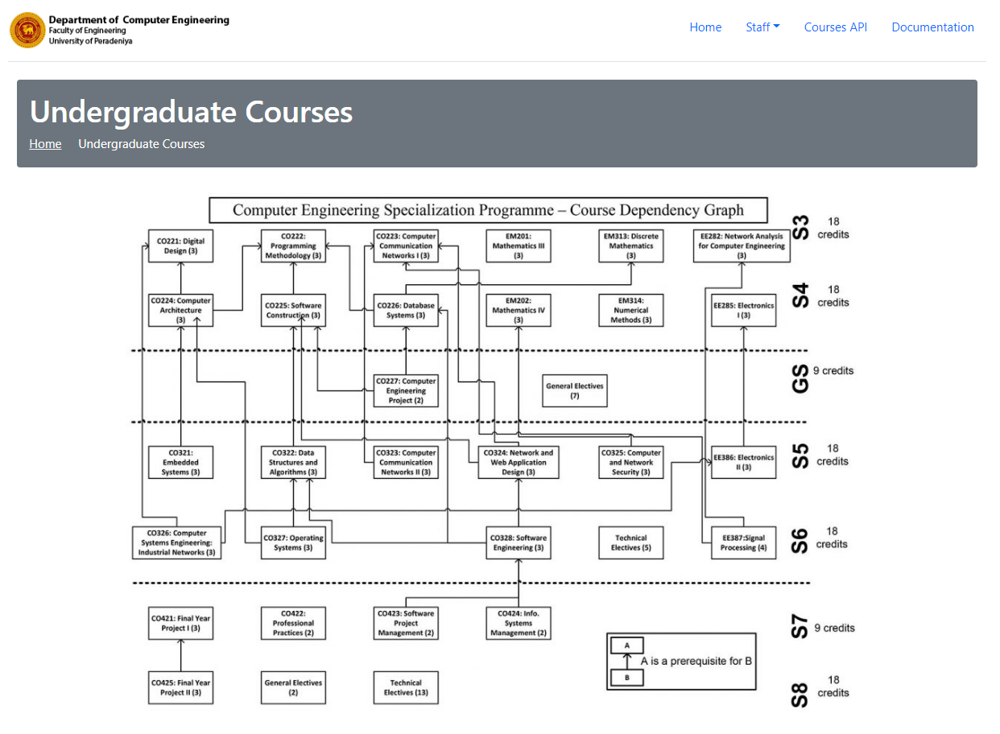

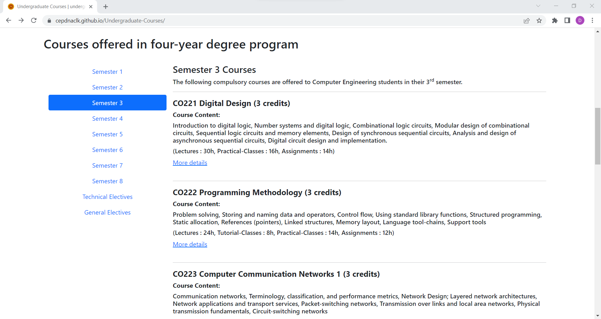

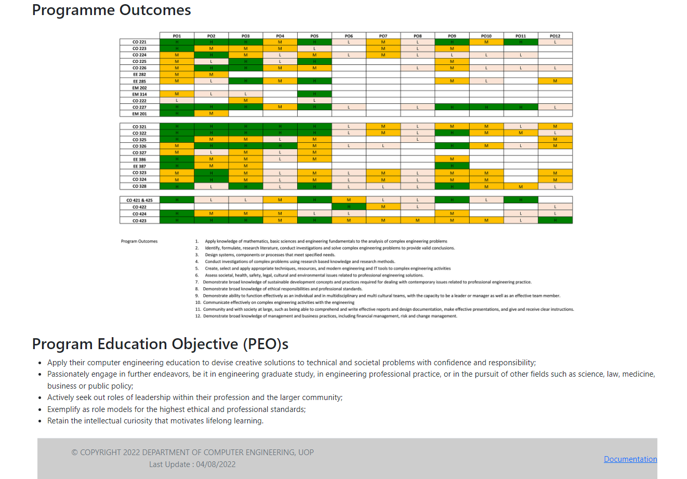

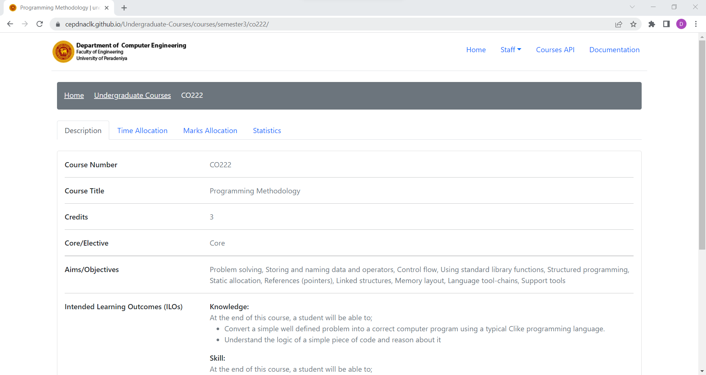

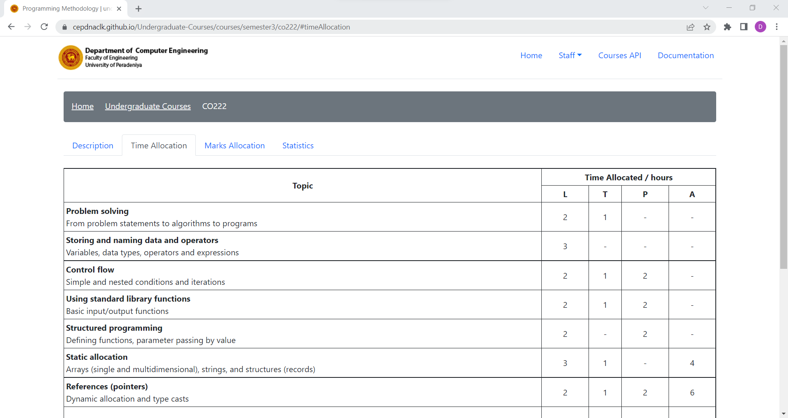

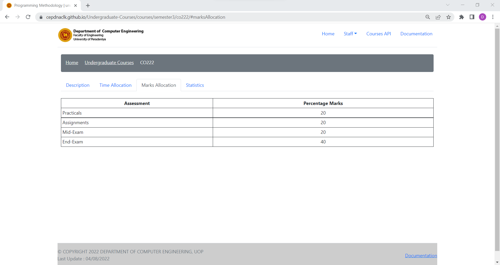

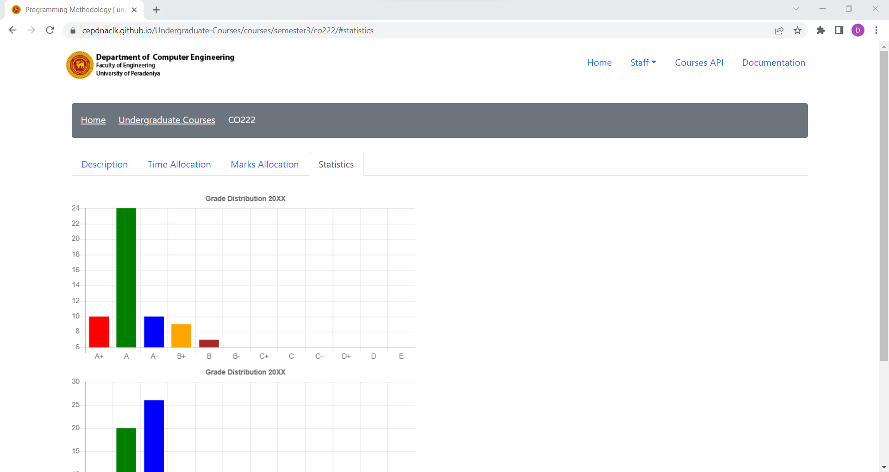

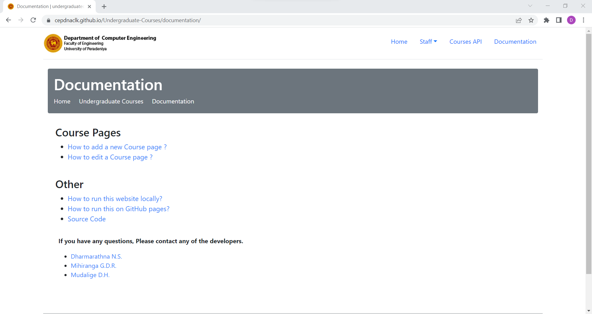

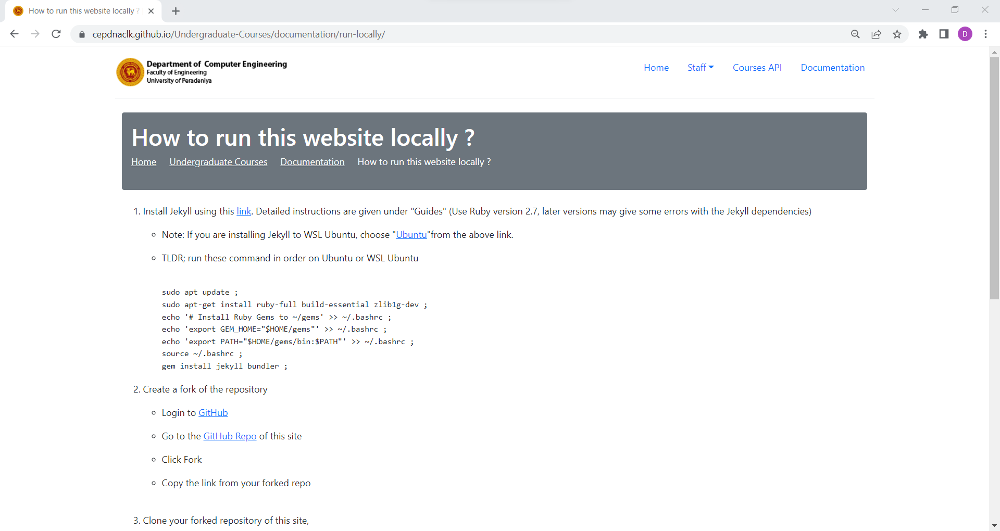

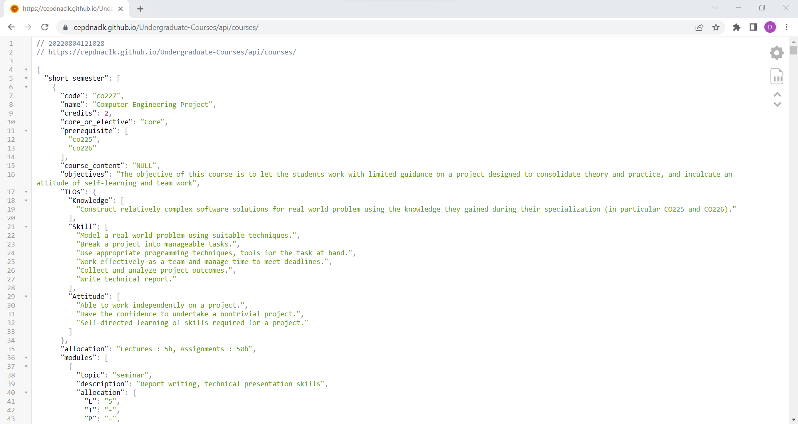

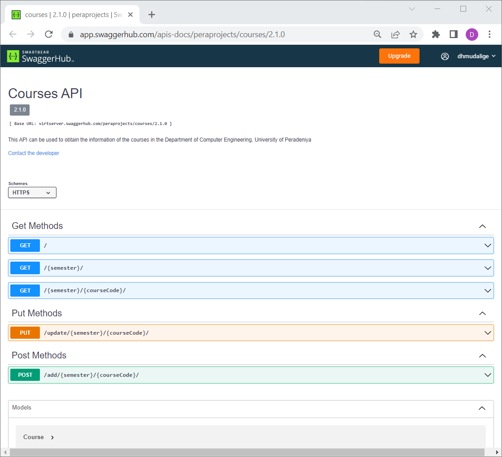

---
### Background and Motivation
- [cs.umd.edu](https://www.cs.umd.edu/class/)
- [continuingstudies.stanford.edu](https://continuingstudies.stanford.edu/courses/courses-by-department)

---
### Considerations for extendability
We have considered to extend our course page with some additional features such as, 
- Displaying marks distribution for grades over course contents
- Detailed graphical representation of grade distribution for past years 
- Sorting and filtering courses

---
### Technology Stack
- HTML and CSS
- JavaScript (Chart.js)
- JSON
- Jekyll
- Boostrap
- Python
- GitHub
- Figma
- Swagger

---
### Documentation

• Github Repository: 
[https://github.com/cepdnaclk/e18-co227-Department-Course-Page-Group-A](https://github.com/cepdnaclk/e18-co227-Department-Course-Page-Group-A) 

• Github Pages: 
[https://cepdnaclk.github.io/e18-co227-Department-Course-Page-Group-A](https://cepdnaclk.github.io/e18-co227-Department-Course-Page-Group-A) 

• Github Wiki: 
[https://github.com/cepdnaclk/e18-co227-Department-Course-Page-Group-A/wiki](https://github.com/cepdnaclk/e18-co227-Department-Course-Page-Group-A/wiki) 

---
### Other Links
- [Department of Computer Engineering GitHub Organization](https://github.com/cepdnaclk)
- [Department of Computer Engineering Website](http://www.ce.pdn.ac.lk/)
- [University of Peradeniya Website](https://eng.pdn.ac.lk/)

[//]: # (Please refer this to learn more about Markdown syntax)
[//]: # (https://github.com/adam-p/markdown-here/wiki/Markdown-Cheatsheet)

